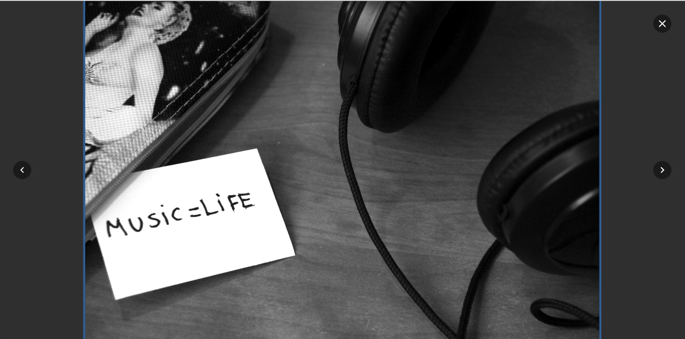

# VanillaBox

Vanilla Js to create beautiful Lightbox without dependencies. It uses [A11Y-dialog](https://github.com/edenspiekermann/a11y-dialog) to address the Lightbox modal and accessibility.


## Features

✔️ No dependencies

✔️ Closing dialog on overlay click and <kbd>ESC</kbd>

✔️ Toggling `aria-*` attributes

✔️ Trapping and restoring focus

✔️ Build with [TypeScript](http://www.typescriptlang.org/) with typings in mind

✔️ Powered by CSS animations, no need for JS animations

✔️ Build with the powerful SASS so you can customize as much as you want

✔️ Highly customizable _(in progress)_

✔️ Tested with Jest _(in progress)_

## Getting Started

You can use it on many environments and in many ways, but I recommend going with npm/yarn installation.

### Prerequisites

You will need to have [Node.js](https://nodejs.org/en/) with npm or [Yarn](https://yarnpkg.com/lang/en/) installed on your machine.

### Installing

Just type on your terminal

```bash
npm install vanillabox -S # with npm
yarn add vanillabox # with yarn
```

## Implementing the VanillaBox

### The Javascript

Then import the module into your main file

```javascript
import VanillaBox from 'vanillabox'

const GalleryImages = document.querySelectorAll('.gallery .images')
const Lightbox = document.getElementById('lightbox-container')
const animationClass = '.is--animating'

VanillaBox({ GalleryImages, Lightbox, animationClass })
```

### The (S)CSS

#### Using SCSS

You gonna need some basic styles. If you’re using SASS we got you cover. Just import into your sass file as follow

```scss
@import '~vanillabox/src/scss/main';
```

#### SCSS Variables

Using SASS/SCSS instead of CSS has the advantage to customize some aspects of the Lightbox. Here are them:

```scss
$tmlb-block: 'lightbox'; // Name of the base selector for all classes

$tmlb-pre-animation-transform: scale(0.98); // Transformation(s) needed for .lightbox__image before in
$tmlb-animating-class: 'is--animating'; // Animating class (should match the used in the Javascript)
$tmlb-animation-name: fadeIn; // Animation name would be used once the .lightbox__image.is--animating
$tmlb-animation-duration: 500ms; // Animation duration
$tmlb-animation-timming: cubic-bezier(0.86, 0, 0.07, 1); // Animation timming-function
$tmlb-max-image-width: 960px; // max width for the .lightbox__image
$tmlb-max-image-height: 520px; // max height for the .lightbox__image
```

#### Using with CSS

Add a good `link` tag at any place in your html file pointing to our precompiled css file

```html
<link href="./node_modules/vanillabox/dist/main.css" re="stylesheet">
```

### The HTML

I decided to be very liberal with the markup and let decide to you. Even thou, we need some special attributes in order to work properly.

#### Needed parts

* `[data-a11y-dialog-hide]` these _attributes_ are used in any component you want to use to close the Lightbox (is inherited from A11YDialog)
* `[data-action="prev"]` this _attribute_ is placed in any component you want to use to load the previous image. If not found both **next/prev** actions will be ignored
* `[data-action="next"]` this is to load the next image. If not found both **next/prev** actions will be ignored
* `.lightbox__image` this class is not required (the element will be created if not found) but is good to have in order to optimize the initialization. The Lightbox image will be loaded on it, and should be an `img` element as well

#### The desired markup

```html
<div class="lightbox-container" aria-hidden="true">
    <div class="lightbox-overlay" tabindex="-1" data-a11y-dialog-hide></div>
    <div role="dialog" class="lightbox">
      <button type="button" class="lightbox__close" data-a11y-dialog-hide aria-label="Cerrar lightbox">
        ✖️
      </button>
      <div role="document" aria-labelledby="lightbox__image">
        <button class="lightbox-controls__prev" data-action="prev" aria-label="Imagen Anterior">
          ⬅️
        </button>
        <button class="lightbox-controls__next" data-action="next" aria-label="Imagen Siguiente">
          ➡️
        </button>
        <div class="lightbox-image">
          
        </div>
        <!-- /.lightbox-image -->
      </div>
      <!-- /.lightbox-content -->
    </div>
    <!-- /.lightbox -->
  </div>
```

## Built With

* [A11YDialog](https://github.com/edenspiekermann/a11y-dialog) - Easy, lightweight and accessible dialog
* [Webpack 4](https://webpack.js.org/) - **THE** module bundler
* [Typescript](http://www.typescriptlang.org/) - Powerful futuristic typings for Javscript

## Versioning

We use [SemVer](http://semver.org/) for versioning. For the versions available, see the [tags on this repository](https://github.com/taverasmisael/vanillabox/tags).

Each release is done with the help of [StandardVersion](https://github.com/conventional-changelog/standard-version)

## Changelog

See a full list of changes on our [Changelog](CHANGELOG.md) file

## Authors

* **Misael Taveras** - _Initial work_ - [TaverasMisael](https://github.com/taverasmisael)

## License

This project is licensed under the MIT License - see the [LICENSE](LICENSE) file for details

## Acknowledgments

* Hat tip to anyone who's code was used
* Inspiration
* Need

## What’s next?

* Add keyboard support
* Add Jest test
* Add more freedom to choose the markup and other configs
* Add events
* Support a full gallery
* Add more options
* Optimize code
* Disable Carrousel Mode
